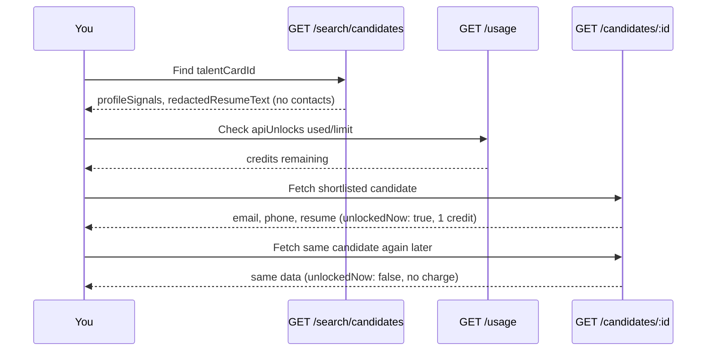

Search hits give you triage data only — **no name, email, or phone**. To contact a candidate you found in search, call **`GET /candidates/{talentCardId}`**.

If the candidate is still locked for your workspace, this call **unlocks them automatically** — spending **one unlock credit** — and returns the full detail in the same response. There is no separate unlock endpoint.

<Note>
  Available to **eval and production keys** (`candidates:read`). Eval workspaces get 10 unlock credits per cycle by default; production workspaces get higher grants. Check `GET /usage`.
</Note>

## Typical flow



1. **Search** — pick `talentCardId` values from [Search candidates](/guides/search-candidates).
2. **Shortlist using triage data** — use `profileSignals` and `redactedResumeText` on search hits; do not fetch details speculatively.
3. **Check credits** — `GET /usage` → `apiUnlocks` (`used` vs `limit`).
4. **Fetch details** — `GET /candidates/{talentCardId}` for each candidate you want to contact. Locked candidates are unlocked on the spot (irreversible, one credit each).

## GET /candidates/{talentCardId}

```
GET /api/v1/candidates/{talentCardId}
```

**Scope:** `candidates:read`

**Rate limits:** 30 sensitiveRead + 120 global requests per 60s per API key.

### Response

```json
{
  "talentCardId": "64f1a2b3c4d5e6f7a8b9c0d1",
  "lockStatus": "unlocked",
  "unlockedNow": true,
  "displayName": "Priya Sharma",
  "headline": "Senior Backend Engineer · Python",
  "email": "priya@example.com",
  "phone": "+919876543210",
  "originalResumeFileName": "Priya_Sharma_Resume.pdf",
  "originalResumeDownloadUrl": "https://s3.amazonaws.com/…/original.pdf?X-Amz-…",
  "profile": {
    "text_from_resume": "…full resume text…",
    "past_companies": ["…"]
  }
}
```

| Field | Meaning |
| --- | --- |
| `unlockedNow` | `true` = this call spent one unlock credit; `false` = candidate was already unlocked (no charge) |
| `originalResumeDownloadUrl` + `originalResumeFileName` | Signed link to the candidate's uploaded resume file (PDF/DOC) — same as **Download resume** in the Cutshort UI |
| `profile` | Structured profile including the actual resume text (~8k chars), past companies, education |

<Note>
  Resume file URLs expire after **1 hour**. Re-call the endpoint for fresh links — repeat calls on unlocked candidates are free.
</Note>

## Unlock credits

Each **new** unlock counts against your workspace's `apiUnlocks` meter for the current cycle. Already-unlocked candidates never re-charge.

Check remaining credits:

```bash
curl -s "https://cutshort.io/api/v1/usage" \
  -H "Authorization: Bearer cs_live_YOUR_KEY"
```

```json
{
  "apiUnlocks": { "used": 3, "limit": 10 },
  "searches": { "used": 40, "limit": 100 },
  "messages": { "used": 2, "limit": 20 },
  "cycleEndsOn": "2026-08-15T00:00:00.000Z"
}
```

When credits are exhausted, `GET /candidates/{id}` on a locked candidate returns **429** with `error_code: api_unlock_limit_reached`. Already-unlocked candidates keep working.

## Example — search, then fetch

```bash
# 1. Search
curl -s -G "https://cutshort.io/api/v1/search/candidates" \
  -H "Authorization: Bearer cs_live_YOUR_KEY" \
  --data-urlencode "q=senior python backend" \
  --data-urlencode "minexp=4" \
  --data-urlencode "page=1"

# 2. Check credits
curl -s "https://cutshort.io/api/v1/usage" \
  -H "Authorization: Bearer cs_live_YOUR_KEY"

# 3. Fetch details for the shortlist (auto-unlocks; 1 credit per new candidate)
curl -s "https://cutshort.io/api/v1/candidates/TALENT_CARD_ID" \
  -H "Authorization: Bearer cs_live_YOUR_KEY"
```

## Best practices

- **Shortlist from search first** — use [Profile signals](/guides/profile-signals) and `redactedResumeText`; only fetch details for candidates you intend to contact.
- **Confirm before fetching in bulk** — each new candidate spends a credit and unlocking cannot be undone.
- **Check `apiUnlocks`** before batch fetches.
- **Fetch sequentially** — not in parallel — to stay within rate limits and make quota errors easier to handle.

## Related

- [Search candidates](/guides/search-candidates) — find `talentCardId` values
- [Message a candidate](/guides/message-candidate) — invite them to apply (no unlock needed)
- [Rate limits](/guides/rate-limits) — burst caps and quotas
- [Authentication](/authentication) — eval vs production key scopes
