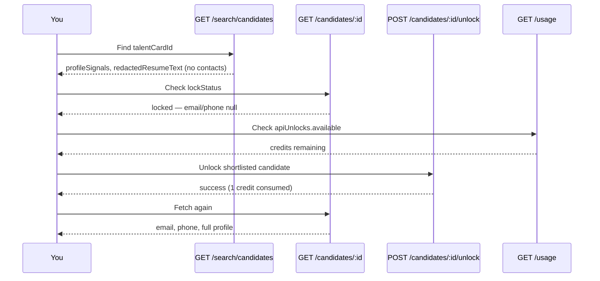

Search hits give you triage data only — **no name, email, or phone**. To contact a candidate you found in search, use **`GET /candidates/{talentCardId}`** and, when locked, **`POST /candidates/{talentCardId}/unlock`**.

<Warning>
  These endpoints require a **production API key** with `candidates:read` (detail) and `candidates:unlock` (unlock). Eval keys (`search:read`, `applications:read`, `jobs:read`) cannot call them.
</Warning>

## Typical flow



1. **Search** — pick `talentCardId` values from [Search candidates](/guides/search-candidates).
2. **Shortlist using triage data** — use `profileSignals` and `redactedResumeText` on search hits; do not unlock speculatively.
3. **Check credits** — `GET /usage` → `apiUnlocks.available`.
4. **Unlock** — `POST /candidates/{talentCardId}/unlock` for each candidate you want to contact (irreversible).
5. **Get details** — `GET /candidates/{talentCardId}` returns email, phone, and full profile when unlocked.

## GET /candidates/{talentCardId}

```
GET /api/v1/candidates/{talentCardId}?resumeVersion=summary&jobContext=<jobId>
```

| Param | Required | Description |
| --- | --- | --- |
| `talentCardId` | yes | From search results or applications |
| `resumeVersion` | no | `summary` (default) or `full` |
| `jobContext` | no | Job ID — includes screening Q&A when the candidate applied to that job **and** is unlocked |

**Scope:** `candidates:read`

**Rate limits:** 30 sensitiveRead + 120 global requests per 60s per API key.

### Lock states

| `lockStatus` | Contact fields | Resume / profile |
| --- | --- | --- |
| **`locked`** | `email` and `phone` are `null`; `displayName` is a pseudonymous handle | No resume files — no `originalResumeDownloadUrl` |
| **`unlocked`** | Real `displayName`, `email`, `phone` | `originalResumeDownloadUrl` (uploaded file), full `profile` |

### Resume file

When unlocked, the API returns the **uploaded resume file** (PDF, DOC, etc.) — same as **Download resume** in the Cutshort UI:

| Field | When | Use case |
| --- | --- | --- |
| `originalResumeDownloadUrl` + `originalResumeFileName` | **Unlocked only** | Download or store the candidate's original resume |

When **locked**, neither field is present — no resume files on this endpoint.

For triage without unlock, use [Search candidates](/guides/search-candidates) (`redactedResumeText` on hits) or [Job applications](/guides/job-applications) (`GET /applications/{id}` includes `redactedResumeText` when locked).

```json
{
  "lockStatus": "unlocked",
  "originalResumeFileName": "Priya_Sharma_Resume.pdf",
  "originalResumeDownloadUrl": "https://s3.amazonaws.com/…/USER_ID/Priya_Sharma_Resume.pdf?X-Amz-…"
}
```

<Note>
  Resume file URLs expire after **1 hour**. Re-call the endpoint for fresh links. When locked, resume files are omitted entirely.
</Note>

Example — locked (before unlock):

```json
{
  "talentCardId": "64f1a2b3c4d5e6f7a8b9c0d1",
  "lockStatus": "locked",
  "displayName": "Candidate #A3F2",
  "headline": "Senior Backend Engineer · Python",
  "email": null,
  "phone": null,
  "profile": { "past_companies": [ "…" ] }
}
```

Example — unlocked (after unlock):

```json
{
  "talentCardId": "64f1a2b3c4d5e6f7a8b9c0d1",
  "lockStatus": "unlocked",
  "displayName": "Priya Sharma",
  "headline": "Senior Backend Engineer · Python",
  "email": "priya@example.com",
  "phone": "+919876543210",
  "originalResumeFileName": "Priya_Sharma_Resume.pdf",
  "originalResumeDownloadUrl": "https://s3.amazonaws.com/…/original.pdf?X-Amz-…",
  "profile": { "…": "…" },
  "screeningQuestions": []
}
```

`GET /candidates/{id}` does **not** consume credits by itself. Credits are charged on **unlock**.

## POST /candidates/{talentCardId}/unlock

```
POST /api/v1/candidates/{talentCardId}/unlock
Content-Type: application/json

{ "jobId": "<optional-job-id>" }
```

**Scope:** `candidates:unlock`

**Rate limits:** 30 unlock + 120 global requests per 60s per API key.

Unlocking is **irreversible** and consumes **one API profile download credit** per candidate (first unlock only — re-unlocking an already-unlocked candidate does not charge again).

### API profile download credits

Each unlock counts against your workspace's **API profile download** budget for the current billing period. This is the same pool as profile unlocks in the Cutshort UI.

Check remaining credits before unlocking:

```bash
curl -s "https://cutshort.io/api/v1/usage" \
  -H "Authorization: Bearer cs_live_YOUR_KEY"
```

```json
{
  "billingPeriod": "2026-07",
  "apiUnlocks": {
    "used": 12,
    "available": 188
  }
}
```

| Field | Meaning |
| --- | --- |
| `apiUnlocks.used` | Profile downloads via API this billing period |
| `apiUnlocks.available` | Effective credits left — `min(plan pool remaining, API unlock limit remaining)` |

When credits are exhausted, unlock returns **429** with `error_code: api_unlock_limit_reached`.

<Note>
  Use `apiUnlocks.available` as the single source of truth. It already accounts for both your plan's profile-download pool and the per-workspace API unlock cap (`maxApiUnlocks`).
</Note>

### Unlock response

```json
{
  "success": true,
  "talentCardId": "64f1a2b3c4d5e6f7a8b9c0d1",
  "unlocksLeft": 187
}
```

If the candidate was already unlocked for your workspace:

```json
{
  "success": true,
  "talentCardId": "64f1a2b3c4d5e6f7a8b9c0d1",
  "alreadyUnlocked": true
}
```

No credit is consumed when `alreadyUnlocked` is `true`.

## Example — search, unlock, contact

```bash
# 1. Search
curl -s -G "https://cutshort.io/api/v1/search/candidates" \
  -H "Authorization: Bearer cs_live_YOUR_KEY" \
  --data-urlencode "q=senior python backend" \
  --data-urlencode "minexp=4" \
  --data-urlencode "page=1"

# 2. Check credits
curl -s "https://cutshort.io/api/v1/usage" \
  -H "Authorization: Bearer cs_live_YOUR_KEY"

# 3. Unlock (production key required)
curl -s -X POST "https://cutshort.io/api/v1/candidates/TALENT_CARD_ID/unlock" \
  -H "Authorization: Bearer cs_live_YOUR_KEY" \
  -H "Content-Type: application/json" \
  -d '{}'

# 4. Get contact details
curl -s "https://cutshort.io/api/v1/candidates/TALENT_CARD_ID" \
  -H "Authorization: Bearer cs_live_YOUR_KEY"
```

## Best practices

- **Shortlist from search first** — use [Profile signals](/guides/profile-signals) and `redactedResumeText`; only unlock candidates you intend to contact.
- **Confirm before unlock** — unlocking spends credits and cannot be undone.
- **Check `apiUnlocks.available`** before batch unlocks.
- **Unlock sequentially** — not in parallel — to stay within rate limits and make quota errors easier to handle.

## Related

- [Search candidates](/guides/search-candidates) — find `talentCardId` values
- [Rate limits](/guides/rate-limits) — burst caps on detail and unlock routes
- [Authentication](/authentication) — eval vs production key scopes
